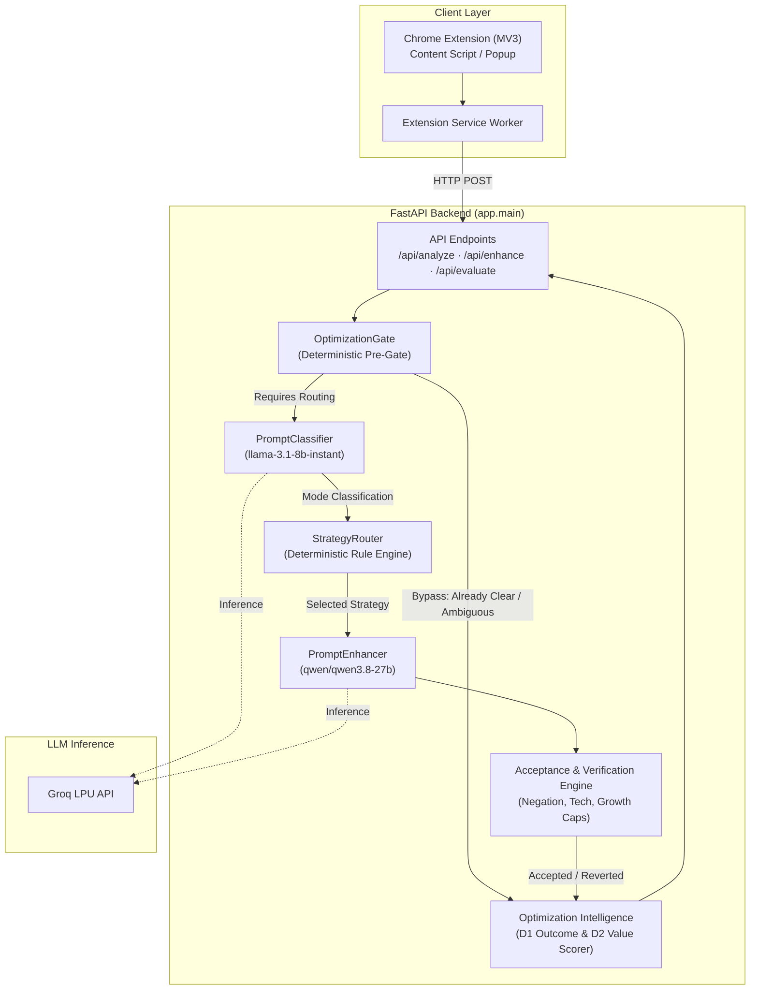

# PromptPilot

> **Intent-Aware Prompt Optimization for LLMs**

PromptPilot is a deterministic, intent-preserving prompt optimization engine and browser extension. It analyzes, refines, structures, or compresses prompts before they are sent to large language models—minimizing token overhead and eliminating conversational fluff without sacrificing constraints, technical accuracy, or output quality.

---

## Why PromptPilot?

Most prompt optimizers fall into two failure modes:
1. **Blind Expansion:** Bloating simple requests with generic, repetitive instructions that increase latency and cost without improving output.
2. **Blind Compression:** Aggressively stripping tokens at the expense of crucial constraints, negative instructions, or domain-specific parameters.

PromptPilot applies **selective optimization**. Every prompt is evaluated through deterministic pre-gates, classified by its primary outcome, routed to a targeted strategy, and guarded by an acceptance engine:

```text
Minimize tokens only when doing so preserves or improves the prompt's ability to produce the intended result.
```

---

## Core Principles

- **Intent Preservation:** Core tasks, user goals, and required output formats are never altered or dropped.
- **Constraint Invariance:** Negative constraints (`"do not..."`, `"without..."`), named technologies (`FastAPI`, `PostgreSQL`), and fenced code blocks survive every rewrite.
- **No Hallucinated Requirements:** The optimizer never invents unrequested libraries, frameworks, or assumptions.
- **Selective Non-Interference:** Clean, direct, or already structured prompts bypass LLM transformation (`NO_CHANGE`).
- **Deterministic Quality Gating:** Model-generated rewrites are treated as untrusted candidates. If an optimization fails acceptance rules, the engine automatically reverts to the original prompt.

---

## Architecture



---

## Optimization Pipeline

```text
USER INPUT
    │
    ▼
[ 1. Optimization Gate ] ────────► (Bypass: Already Efficient / Ambiguous)
    │
    ▼
[ 2. Prompt Classifier ] ────────► Categorizes outcome: concise | detailed | code | creative
    │
    ▼
[ 3. Strategy Router ]   ────────► Selects: NO_CHANGE | COMPRESS | STRUCTURE | REFINE | CREATIVE_EXPAND
    │
    ▼
[ 4. Prompt Enhancer ]   ────────► Generates candidate rewrite via Groq LPU
    │
    ▼
[ 5. Acceptance Engine ] ────────► Validates negations, syntax, code fences, token ceilings
    │
    ├── (Passed)  ──► ACCEPT
    └── (Failed)  ──► REVERT to original prompt
    │
    ▼
[ 6. Decision Intelligence ] ────► Assigns D1 Outcome & D2 Value metadata
    │
    ▼
FINAL OPTIMIZED PROMPT
```

1. **Optimization Gate:** Evaluates length, ambiguity, and existing structure in `< 0.1ms` without LLM calls. Bypasses clean inputs.
2. **Prompt Classifier:** Routes the user's intended outcome using a low-latency model (`llama-3.1-8b-instant`).
3. **Strategy Router:** Maps classification and structural signals into an exact transformation strategy.
4. **Prompt Enhancer:** Generates the candidate rewrite using active strategy rules and few-shot guidance.
5. **Acceptance & Verification:** Verifies that no negations were dropped, technical keywords were preserved, code fences remain verbatim, and token growth is within strict mode ceilings.
6. **Decision Intelligence:** Classifies the optimization outcome and computes efficiency scores for telemetry and evaluation.

---

## Optimization Strategies

| Strategy | Purpose | Acceptance Policy |
| :--- | :--- | :--- |
| `NO_CHANGE` | Leaves prompt untouched when already clear, concise, or structured. | Always preserves original text (`0 overhead tokens`). |
| `COMPRESS` | Removes conversational fluff, filler words, and redundant phrasing. | Candidate token count must not exceed original count (`tokens_saved > 0`). |
| `STRUCTURE` | Reorganizes messy, multi-clause requests into numbered requirements and sections. | Growth requires visible section headers, numbered items, or bullets. |
| `REFINE` | Polishes grammar and technical precision for single-intent prose. | Strictly capped growth tolerance (maximum +8 tokens). |
| `CREATIVE_EXPAND` | Broadens artistic, narrative, or open ideation prompts within safe boundaries. | Bounded by mode ceiling ratios (2.5× max) to prevent invented constraints. |

---

## Quality Protection & Acceptance

Candidate enhancements generated by language models are **never blindly trusted**. The engine enforces four deterministic acceptance invariants:

1. **Negation Survival:** Every explicit negation (`do not`, `must not`, `never`, `without`) must appear in the rewrite verbatim or through a validated equivalent (`avoid`, `exclude`).
2. **Technical Term Preservation:** Explicitly named technologies, databases, languages, and tools (`FastAPI`, `PostgreSQL`, `Docker`, `JWT`) must survive the rewrite.
3. **Fenced Code Block Immutability:** Any code block enclosed in triple backticks (` ``` `) must appear byte-for-byte in the output.
4. **Token Growth Ceilings:** Strict growth limits prevent runaway token inflation.

```text
Decision Outcomes:
- ACCEPT: Candidate satisfied all invariants and added clear value.
- NO_CHANGE: Optimization bypassed by gate or strategy router.
- REVERT: Candidate violated an invariant or exceeded ceilings; original prompt preserved.
- BYPASS: Input was sub-threshold or ambiguous; preserved safely.
```

---

## Optimization Intelligence

PromptPilot annotates every optimization decision with standardized diagnostic telemetry:

### D1 Outcomes
- `ALREADY_EFFICIENT`: Input was already optimal; bypassed transformation.
- `COMPRESSED`: Fluff removed; net token savings achieved.
- `USEFUL_EXPANSION`: Prompt expanded with verified structural organization.
- `WORDING_REFINEMENT`: Minor grammar or precision polish applied within tolerance.
- `UNNECESSARY_EXPANSION_PREVENTED`: Hallucinated or excessive rewrite caught and reverted.
- `PRESERVED_AMBIGUOUS`: Underspecified prompt preserved without speculative assumptions.

### D2 Value Ratings
- `HIGH_VALUE_COMPRESSION` / `MODERATE_COMPRESSION` / `LOW_VALUE_COMPRESSION`
- `JUSTIFIED_EXPANSION` / `LOW_VALUE_EXPANSION`
- `WORDING_REFINEMENT`
- `NO_OPTIMIZATION_NEEDED`

---

## Benchmarking (D3 & D4)

PromptPilot includes an automated regression benchmark covering diverse prompt archetypes (code specifications, conversational filler, creative requests, adversarial injections, and ambiguous statements).

### Verified Benchmark Suite Results

| Benchmark Dimension | Target Invariant | Result |
| :--- | :--- | :---: |
| **Quality Preservation** | Core intent and constraints preserved across all test archetypes | **100% (10/10)** |
| **Successful Compression** | Conversational filler compressed with net token savings | **100% (3/3)** |
| **Damaging Compression Rejection** | Reversion triggered when compression attempts drop negations/tech | **100% (2/2)** |
| **Useful Expansion Acceptance** | Structural expansion approved only when organization is added | **100% (4/4)** |

> *Note: These are results from the curated test benchmark cases and do not represent statistical guarantees across all possible user prompts.*

---

## Production Hardening

The backend includes production-grade security and reliability safeguards:

- **CORS Hardening:** Environment-aware origin filtering via `ALLOWED_ORIGINS`. In production mode (`ENVIRONMENT=production`), explicit origins are required and wildcard `*` origins are strictly rejected. Local development origins (`localhost`, `127.0.0.1`) are permitted by default in development mode.
- **Bounded Latency & Timeouts:** Fast-failing per-request timeouts (10.0s for classifier, 15.0s for enhancer) with bounded exponential backoff (1 retry max for enhancer). Worst-case failure latency is constrained to prevent hanging client connections.
- **Untrusted Prompt Framing:** Untrusted user input is strictly encapsulated within `<user_prompt_untrusted>` XML blocks to mitigate indirect prompt injection.

---

## Technology Stack

- **Backend:** Python 3.10+, FastAPI, Pydantic v2, Uvicorn
- **LLM Inference:** Groq Python SDK (`llama-3.1-8b-instant`, `qwen/qwen3.8-27b`)
- **Token Accounting:** Tiktoken
- **Testing:** Pytest, AnyIO
- **Browser Extension:** Chrome Extension Manifest V3 (Vanilla JS/CSS)

---

## Project Structure

```text
promptpilot/
├── README.md                           # Project documentation
├── .gitignore                          # Repository exclusions (.env, venv, caches)
├── extension/                          # Chrome Extension (Manifest V3)
│   ├── manifest.json                   # Extension manifest
│   ├── background/
│   │   └── service-worker.js           # Background fetch & message handler
│   ├── popup/
│   │   ├── popup.html                  # Extension popup UI
│   │   ├── popup.css
│   │   └── popup.js
│   └── content/
│       ├── content.js                  # DOM injection & keyboard shortcuts
│       ├── styles.css
│       └── adapters/
│           ├── adapter-interface.js    # UI adapter base interface
│           └── chatgpt.js              # ChatGPT web UI adapter
└── backend/                            # FastAPI Optimization Backend
    ├── requirements.txt                # Python dependencies
    ├── app/
    │   ├── main.py                     # FastAPI app, CORS, routes, lifecycle
    │   └── services/
    │       ├── optimization_gate.py    # Pre-gate heuristics & fast bypass
    │       ├── prompt_classifier.py    # Route-only classification service
    │       ├── strategy_router.py      # Deterministic strategy resolution
    │       ├── strategy_rules.py       # Strategy system rules
    │       ├── enhancement_rules.py    # Core & mode-specific prompt rules
    │       ├── prompt_enhancer.py      # LLM orchestration & acceptance policy
    │       ├── prompt_evaluator.py     # Effectiveness & token accounting
    │       ├── prompt_analyzer.py      # Prompt quality & clarity analysis
    │       ├── optimization_intelligence.py # Outcome & value scoring
    │       └── token_utils.py          # Token measurement utilities
    ├── test_api.py                     # API endpoint smoke tests
    ├── test_cors.py                    # CORS environment unit tests
    ├── test_timeout_retry.py           # Timeout & retry unit tests
    └── test_*.py                       # Comprehensive Phase A-D regression suite
```

---

## Getting Started

### Prerequisites
- Python 3.10 or higher
- A [Groq API Key](https://console.groq.com/)

### 1. Clone the Repository
```bash
git clone <repository-url>
cd promptpilot/backend
```

### 2. Set Up a Virtual Environment

**Windows (PowerShell):**
```powershell
python -m venv venv
.\venv\Scripts\Activate.ps1
```

**macOS / Linux:**
```bash
python3 -m venv venv
source venv/bin/activate
```

### 3. Install Dependencies
```bash
pip install -r requirements.txt
```

### 4. Configure Environment Variables
Create a `.env` file in the `backend/` directory:

```env
GROQ_API_KEY=your_groq_api_key_here
GROQ_MODEL=qwen/qwen3.8-27b
GROQ_CLASSIFIER_MODEL=llama-3.1-8b-instant

# Optional backend security
ENVIRONMENT=development
ALLOWED_ORIGINS=http://localhost:8000,http://127.0.0.1:8000
BACKEND_API_KEY=
```

### 5. Run the Backend Server
```bash
uvicorn app.main:app --reload --port 8000
```
The backend will be available at `http://127.0.0.1:8000`.

### 6. Install Chrome Extension
1. Open Google Chrome and navigate to `chrome://extensions/`.
2. Enable **Developer mode** in the top right corner.
3. Click **Load unpacked** and select the `promptpilot/extension/` directory.

---

## API Reference

### `GET /health`
Liveness check.
```json
{
  "status": "ok",
  "service": "PromptPilot Backend"
}
```

### `POST /api/analyze`
Analyze clarity, token counts, and directness of a prompt without rewriting.
- **Request:** `{"prompt": "string"}`
- **Response:** `{"score": int, "is_direct": bool, "token_count": int, ...}`

### `POST /api/enhance`
Optimize a prompt using the full classification, routing, and acceptance pipeline.
- **Request:** `{"prompt": "string", "mode": "auto"}` (valid modes: `auto`, `concise`, `detailed`, `code`, `creative`)
- **Response:**
```json
{
  "success": true,
  "original_prompt": "string",
  "enhanced_prompt": "string",
  "decision": "enhanced | unchanged | reverted",
  "mode": "code",
  "detected_mode": "code",
  "strategy": "structure",
  "optimization_outcome": "useful_expansion",
  "optimization_value": "justified_expansion",
  "tokens_saved": 14,
  "enhancement_overhead_tokens": 185
}
```

### `POST /api/evaluate`
Compare original vs. enhanced prompt effectiveness and net token savings.
- **Request:** `{"original": "string", "enhanced": "string", "enhancement_overhead_tokens": 0}`
- **Response:** `{"estimated_effectiveness": "string", "net_tokens_saved": int, ...}`

---

## Testing

PromptPilot enforces comprehensive unit, integration, and regression testing with deterministic mocks (no live API credits consumed during tests).

```bash
cd backend
pytest -q
```

**Current Test Status:** `244 passed (100% passing)`

Test domains covered:
- OptimizationGate heuristics and bypasses
- PromptClassifier routing and mode detection
- StrategyRouter boundary rules
- Phase C Acceptance Engine (negation, technical stack, code fence preservation)
- D1 Decision Intelligence and D2 Optimization Value scoring
- D3 Quality Benchmark and D4 Token-Efficiency Benchmark
- API Contract Schema validation
- E2-1 CORS environment hardening
- E1-1 Timeout, bounded retries, and transient failure recovery

---

## Engineering Philosophy

```text
Better prompt ≠ longer prompt
Better prompt ≠ shorter prompt

Better prompt =
    preserved intent
  + preserved constraints
  + improved clarity
  + useful structure
  + efficient wording
```

---

## Project Status

| Component | Status | Test Coverage |
| :--- | :---: | :---: |
| **Phase A** (Core Pipeline & Heuristics) | `FROZEN` | Covered |
| **Phase B** (API Contract & Schemas) | `FROZEN` | Covered |
| **OptimizationGate** | `FROZEN` | Covered |
| **Phase C** (Acceptance Policies & Verification) | `FROZEN` | Covered |
| **D1 Token Intelligence** | `FROZEN` | Covered |
| **D2 Optimization Value** | `FROZEN` | Covered |
| **D3 Optimization Quality Benchmark** | `FROZEN` | Covered |
| **D4 Token-Efficiency Benchmark** | `FROZEN` | Covered |
| **Phase E Production Hardening** (CORS, Timeouts, Hygiene) | `COMPLETE` | Covered |
| **Current Regression Suite** | `PASSING` | **244 / 244 Passed** |

---

